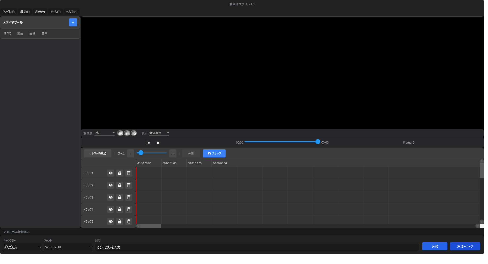
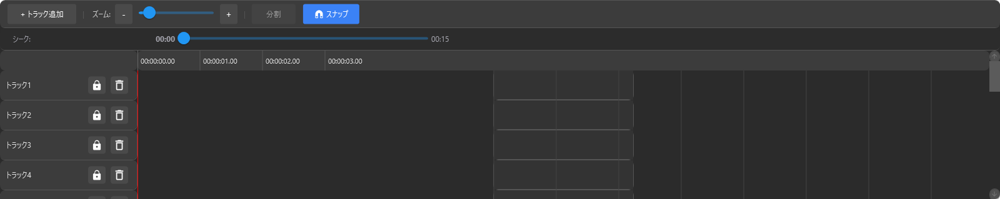
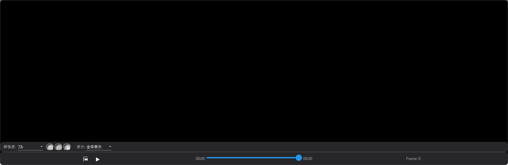

# 動画作成ツール (VideoCreatorTool)

WPFで開発された本格的な動画編集ソフトです。VOICEROID/VOICEVOX連携による音声合成、テキスト字幕・音声ブロックのタイムライン編集、BGM管理、動画エクスポート機能を備えています。



## メイン画面


- 左側：メディアプール
- 右上：プレビュー画面
- 右下：タイムライン
- 下部：字幕入力バー

## 目次

- [主な機能](#主な機能)
- [インストール](#インストール)
- [使い方](#使い方)
- [プロジェクト管理](#プロジェクト管理)
- [ショートカットキー](#ショートカットキー)
- [開発](#開発)
- [ライセンス](#ライセンス)

## 主な機能

### タイムライン編集



- **複数トラック対応**: トラックを自由に追加・削除可能
- **ブロック編集**:
  - テキストブロック（字幕表示）
  - 音声ブロック（VOICEROID/VOICEVOX連携）
  - 動画ブロック
  - BGMブロック
- **ブロック操作**:
  - ドラッグ＆ドロップで移動
  - 左右端をドラッグして長さ変更
  - 複数選択（Ctrl/Shift + クリック）
  - 分割機能
- **スナップ機能**: ブロック同士を自動的に吸着
- **ズーム機能**: タイムラインの拡大・縮小
- **プレイヘッド**: クリックでシーク、自動スクロール

### トラック機能

- **トラック管理**:
  - 名前編集（ダブルクリック）
  - 有効/無効切り替え（enabledアイコン、無効で自動ロック）
  - 表示/非表示切り替え（ eyeアイコン ）
  - ロック/アンロック（ lockアイコン ）
  - 削除（ゴミ箱アイコン）
- **トラック間ドラッグ**: ブロックを他のトラックに移動可能
- **ミュート機能**: トラックごとのミュート（ speakerアイコン ）
- **シークバー**: タイムライン上部に現在位置と総時間を表示

### メディアプール

- **メディアインポート**: 動画・画像・音声ファイルをサポート
- **フィルター機能**: すべて/動画/画像/音声 で絞り込み
- **サムネイル表示**: メディアの種類に応じたアイコン表示
- **ドラッグ＆ドロップ**: タイムラインに直接配置可能

### プレビュー



- **動画プレビュー**: メディアファイルを即時プレビュー
- **再生コントロール**: 最初に戻る/再生/停止ボタン
- **解像度切替**: フル/1/2/1/4 の表示スケール
- **表示モード**: 全体表示/拡大/100%
- **グリッド表示**: 三分割法のグリッド表示
- **セーフエリア**: 90%/93%のセーフエリア表示
- **オニオンスキン**: 前後フレームの半透明表示

### 字幕入力

- **簡単入力**: テキストを入力して「追加」ボタン
- **キャラクター選択**: 話者を選択可能（上部または下部のキャラクター選択）
- **音声自動生成**: VOICEVOX連携でテキストから音声生成
- **音声/テキスト同調**: 音声ファイルの長さに基づいて両ブロックの長さを自動調整
- **ブロック重複防止**: プレイヘッド位置にブロックがある場合、空トラックに自動配置

### BGM管理

- **BGMインポート**: 音声ファイルをBGMとして登録
- **BGM編集**: 開始位置・長さ・音量を調整
- **フェードイン/アウト**: 音声のフェード効果を設定

### 動画エクスポート

- **エクスポート機能**: 動画をMP4形式で出力
- **解像度設定**: 出力解像度を選択可能
- **BGMミキシング**: BGMを動画に重ねて出力

## インストール

### 前提条件

- Windows 10/11
- .NET 9.0 Desktop Runtime
- VOICEVOX（オプション、音声生成に使用）

### インストール手順

1. [Releases](https://github.com/B4129/VideoCreatorTool/releases) から最新バージョンをダウンロード
2. ZIPファイルを解凍
3. `VideoCreator.exe` を実行

## 使い方

### プロジェクトの作成

1. `ファイル` → `新規プロジェクト` を選択
2. ウィンドウが開いたら編集開始

### メディアのインポート

1. 左側のメディアプールで `＋` ボタンをクリック
2. 動画・画像・音声ファイルを選択
3. メディアプールにサムネイルが表示される

### タイムラインにメディアを追加

1. メディアプールのアイテムをタイムラインにドラッグ＆ドロップ
2. トラックのヘッダー部分に配置すると新しいトラックとして追加
3. トラックの空き領域に配置するとその位置に追加

### 字幕・音声の追加

1. 下部の入力欄にセリフを入力
2. キャラクターを選択（ずんだもん/四国めたん/春日部つむぎ）
3. フォント設定を調整（オプション）
4. `追加` ボタンをクリック
5. テキストブロックと音声ブロックがタイムラインに追加されます

### トラック操作

- **名前変更**: トラック名をダブルクリック
- **表示/非表示**: eyeアイコンをクリック
- **ロック**: lockアイコンをクリック（編集不可）
- **ミュート**: speakerアイコンをクリック
- **削除**: ゴミ箱アイコンをクリック

### ブロック操作

- **移動**: ブロックをドラッグ
- **長さ変更**: ブロックの左右端をドラッグ
- **分割**: ブロックを選択してツールバーの `分割` ボタン
- **複数選択**: Ctrl/Shift + クリック

### プレビュー

- **再生/一時停止**: スペースキー または 再生ボタン
- **シーク**: タイムライン上部のシークバーで現在位置と総時間を表示
- **ズーム**: ツールバーの `-` `+` ボタンまたはスライダー

### 動画をエクスポート

1. `ファイル` → `動画エクスポート` を選択
2. 出力設定を確認
3. `エクスポート` ボタンをクリック

## プロジェクト管理

### 自動保存

- **30秒ごと** に自動保存されます
- 保存先: `C:\Users\[ユーザー名]\Desktop\VideoCreator_AutoSave\`
- ファイル名: `AutoSave_YYYYMMDD_HHMMSS.json`

### 手動保存

- `ファイル` → `保存` (Ctrl+S)
- `ファイル` → `名前を付けて保存`

### プロジェクトを開く

- `ファイル` → `プロジェクトを開く` (Ctrl+O)
- または自動保存ファイルから復旧

## ショートカットキー

| キー | 機能 |
|------|------|
| `Ctrl+N` | 新規プロジェクト |
| `Ctrl+O` | プロジェクトを開く |
| `Ctrl+S` | 保存 |
| `Space` | 再生/一時停止 |

## 開発

### 技術スタック

- **フレームワーク**: .NET 9.0, WPF
- **UIライブラリ**: MaterialDesignThemes
- **音声合成**: VOICEVOX API
- **メディア処理**: Windows Shell API

### プロジェクト構造

```
VideoCreatorWPF/
├── Commands/         RelayCommandなど
├── Converters/       XAMLコンバーター
├── Core/             イベントバス
├── Events/           イベント定義
├── Models/           データモデル
├── Services/         ビジネスロジック
│   ├── VoiceVoxService.cs       音声生成
│   ├── MediaMetadataService.cs  メタ情報取得
│   ├── ExportService.cs         動画エクスポート
│   └── AutoSaveService.cs       自動保存
├── ViewModels/       MVVM ViewModel
│   ├── TimelineViewModel.cs     タイムライン管理
│   ├── PreviewViewModel.cs      プレビュー
│   ├── MediaPoolViewModel.cs    メディアプール
│   └── MainWindowViewModel.cs   メインウィンドウ
├── Views/            XAMLビュー
│   ├── TimelineView.xaml        タイムライン
│   ├── PreviewView.xaml         プレビュー
│   ├── MediaPoolView.xaml       メディアプール
│   └── ...
├── MainWindow.xaml   メインウィンドウ
└── App.xaml          アプリケーションエントリポイント
```

### ビルド

```bash
cd VideoCreatorWPF
dotnet build
dotnet run
```

### 必要なパッケージ

- `Newtonsoft.Json` - JSON処理
- `MaterialDesignThemes` - Material Design UI

## ライセンス

このプロジェクトはMITライセンスの下で公開されています。

## 謝辞

- [VOICEVOX](https://voicevox.hiroshiba.jp/): 音声合成エンジン
- [Material Design in XAML](https://github.com/MaterialDesignInXAML/MaterialDesignInXamlToolkit): UIテーマ

---

**作者**: B4129
**リポジトリ**: https://github.com/B4129/VideoCreatorTool
